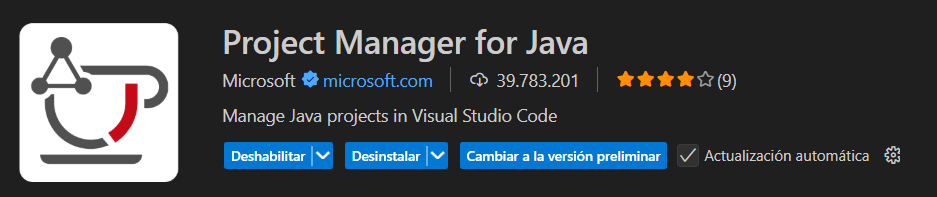
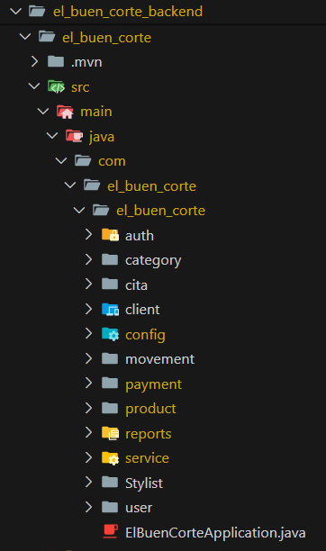
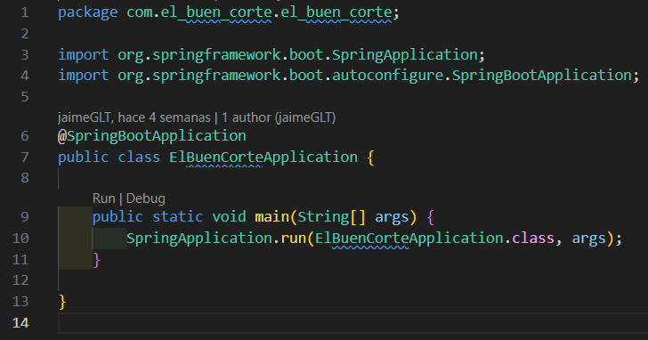

# Levantar el entorno de desarrollo (Frontend)

## Ejecutar localmente

1. Clonar el proyecto

    ```bash
   git clone https://github.com/JaimeGLT/el_buen_corte_backend.git
    ```
    <br>
2. Ir al directorio del proyecto donde se clono el repositorio

    ```bash
    cd mi-proyecto
    ```
    <br>
3. Crear la base de datos en Postgres SQL 16

    Base de datos : `el_buen_corte`

    <br>
4. Configurar el archivo `application.properties`
    

    Dentro de este archivo se encuentra la configuracion de la conexion a la base de datos, configurar el password de la conexion de Postgre sql.

    <br>
5. Instalar en el equipo el `JDK 17`

    ```bash
    https://www.oracle.com/java/technologies/javase/jdk17-archive-downloads.html
    ```
    <br>
6. Instalar la extencion de Java para ejecutar el servidor:

    `Project Manager for Java`

    

    <br>
7. Ejecutar el backend en el archivo `ElBuenCorteApplication.java`

    

    Abrir el archivo y hacer click en la opcion de: `Run|Debug` linea: `9`

    

    <div style=" color:#dffda7; "> Ahora se esta ejecutando el backend</div>

# Configuración del Entorno Backend

## Requisitos Previos

- **Java 17**: Instalar JDK 17 (OpenJDK o Oracle JDK).
- **Maven**: Para gestión de dependencias (viene con wrapper `mvnw`).
- **PostgreSQL**: Base de datos, versión 12+ recomendada.
- **Git**: Para clonar el repositorio.

## Instalación de Dependencias

1. Clonar el repositorio:

   ```
   git clone <url-del-repo>
   cd el_buen_corte_backend/el_buen_corte
   ```

2. Instalar dependencias con Maven:

   ```
   ./mvnw clean install
   ```

## Configuración de Base de Datos

1. Instalar PostgreSQL y crear base de datos:

   ```
   createdb el_buen_corte
   ```

2. Configurar usuario y contraseña (por defecto en `application.properties`: postgres/1234).

3. Las migraciones Flyway se ejecutan automáticamente al iniciar la aplicación.

## Variables de Entorno (Opcional)

Para producción, usar variables de entorno en lugar de valores hardcodeados:

- `DB_URL`: URL de conexión a BD (ej: jdbc:postgresql://localhost:5432/el_buen_corte)
- `DB_USERNAME`: Usuario de BD
- `DB_PASSWORD`: Contraseña de BD
- `JWT_SECRET`: Clave secreta para JWT (generar una segura)

## Ejecución

1. Ejecutar la aplicación:

   ```
   ./mvnw spring-boot:run
   ```

2. La API estará disponible en `http://localhost:8080`.

## Docker (Opcional)

Si se usa Docker:

1. Construir imagen:

   ```
   docker build -t el-buen-corte-backend .
   ```

2. Ejecutar contenedor:

   ```
   docker run -p 8080:8080 el-buen-corte-backend
   ```

Asegurarse de que PostgreSQL esté corriendo y accesible.

## Pruebas

Ejecutar tests:

```
./mvnw test
```

## Notas

- Puerto por defecto: 8080.
- Logs en consola para debugging.
- Para desarrollo, usar perfil `dev` si se configura.
